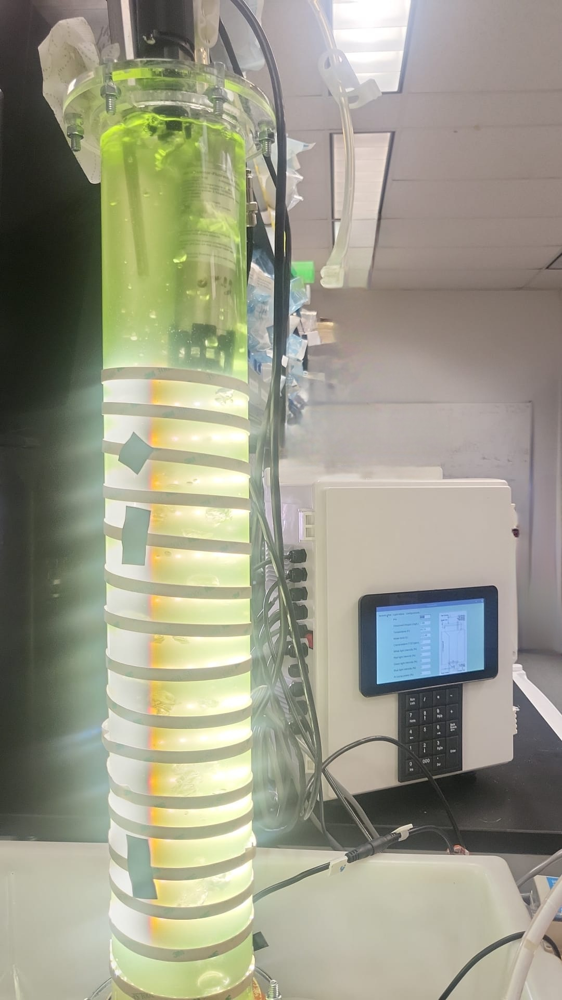
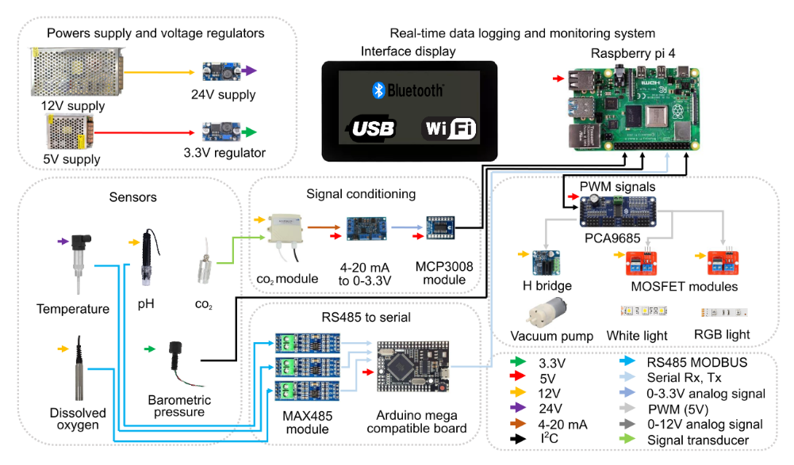

# ALG-FLex
### Open-Source Raspberry Pi-Based Instrumentation Platform for Photobioreactors

<p align="center">

</p>

ALG-FLex is an open-source instrumentation platform designed for real-time monitoring and control of laboratory-scale photobioreactors using a Raspberry Pi 4. The system was developed to provide an affordable and flexible alternative to commercial bioreactor controllers while maintaining reliable acquisition of biological variables and automated control of illumination and auxiliary devices.

The experimental validation presented in our research was performed using a laboratory column photobioreactor. However, the software is independent of the reactor geometry and can be adapted to different photobioreactor configurations by modifying only the hardware installation.

---

# Features

- Real-time monitoring of biological variables
- Automatic daily data logging
- Touch-screen graphical interface
- PWM control of illumination systems
- Serial, SPI and I²C communications
- Modular software architecture
- Low-cost open-source hardware
- Easily adaptable to different photobioreactor geometries

---

# Repository Structure

```text
ALG-FLex
│
├── BioreactorApp/
├── Data/
│   ├── Raw/
│   ├── Processed/
│   └── Metadata/
├── Hardware/
│   └── WiringDiagram.png
├── Images/
│   └── bioreactor.png
├── LICENSE
├── requirements.txt
└── README.md
```

---

# Hardware Requirements

## Main Hardware

| Component | Quantity |
|------------|:-------:|
| Raspberry Pi 4 (8 GB RAM) | 1 |
| microSD Card (128 GB) | 1 |
| Arduino Mega compatible board | 1 |
| Raspberry Pi Touch Display | 1 |

## Power Supply

| Component | Quantity |
|------------|:-------:|
| 12 V Switching Power Supply | 1 |
| 5 V Switching Power Supply | 1 |
| 12→24 V DC/DC Converter | 1 |
| 5→3.3 V Regulator | 1 |

## Communication and Control Modules

| Module | Quantity |
|------------|:-------:|
| MAX485 | 3 |
| PCA9685 | 1 |
| MCP3008 | 1 |
| H-Bridge | 1 |
| MOSFET Modules | 4 |

## Sensors

| Sensor | Quantity |
|------------|:-------:|
| Temperature | 1 |
| pH | 1 |
| Dissolved Oxygen | 1 |
| CO₂ | 1 |
| Barometric Pressure | 1 |

## Actuators

| Actuator | Quantity |
|------------|:-------:|
| White LED Strip | 1 |
| RGB LED Strip | 1 |
| Vacuum Pump | 1 |

---

# Optional Hardware

| Device | Purpose |
|------------|----------------|
| HDMI Monitor | Display |
| USB Keyboard | User Input |
| USB Mouse | Navigation |

---

# Hardware Connections

The default hardware connections used during the experimental validation are illustrated below.

All modules share a common electrical ground (GND), while independent power buses are used for each voltage level to minimize electrical noise and improve measurement reliability.

Communication interfaces include UART, SPI, I²C and PWM.

<p align="center">

</p>

---

# Source Code Description

| File | Description |
|------|-------------|
| **BioreactorV0.1R.py** | Main application integrating the GUI, data acquisition, actuator control, communications and data logging. This version was used during the experimental growth tests. |
| **BioreactorV0.1R_.py** | Backup version of the main application. |
| **Co2Sen.py** | Reads the CO₂ sensor through the MCP3008 ADC using the SPI interface. |
| **RdMega.py** | Serial communication between Raspberry Pi and Arduino Mega for temperature, pH and dissolved oxygen acquisition. |
| **ReadPress.py** | Reads the MS5837 pressure sensor and estimates liquid level. |
| **ms5837.py** | Driver library for the MS5837 pressure sensor. |
| **ReadSerial.py** | Initializes and configures the Raspberry Pi serial port. |
| **SaveDataDay.py** | Automatically stores one data file per day. |
| **ServPWM.py** | Controls the PCA9685 PWM module for LEDs, MOSFETs, pumps, valves and other PWM devices. |

---

# Example Dataset

| Folder | Description |
|--------|-------------|
| Raw | Original files generated directly by ALG-FLex. |
| Processed | Cleaned datasets for analysis. |
| Metadata | Variable definitions, units and acquisition information. |

---

# Installation

Clone the repository:

```bash
git clone https://github.com/username/ALG-FLex.git
cd ALG-FLex
```

Install dependencies:

```bash
pip3 install -r requirements.txt
```

Run the application:

```bash
python3 BioreactorV0.1R.py
```

---

# requirements.txt

```text
Adafruit-GPIO
adafruit-circuitpython-mcp3xxx
adafruit-blinka
pyserial
spidev
smbus2
RPi.GPIO
numpy
matplotlib
Pillow
python3-tk
pandas
scipy
opencv-python
```

---

# Troubleshooting

| Error | Solution |
|------|----------|
| ModuleNotFoundError: tkinter | pip3 install python3-tk |
| ModuleNotFoundError: serial | pip3 install pyserial |
| ModuleNotFoundError: Adafruit_GPIO | pip3 install Adafruit-GPIO |
| ModuleNotFoundError: Adafruit_MCP3008 | pip3 install adafruit-mcp3008 |
| ModuleNotFoundError: spidev | pip3 install spidev |

---

# Contributing

Contributions are welcome. Researchers and developers are encouraged to improve the platform by adding new sensors, control algorithms, graphical interface enhancements and support for additional photobioreactor configurations.

Please submit a Pull Request describing your proposed modifications.

---

# Citation

Citation information will be added after publication.

---

# License

This project is released under the MIT License.

See the **LICENSE** file for complete license information.
